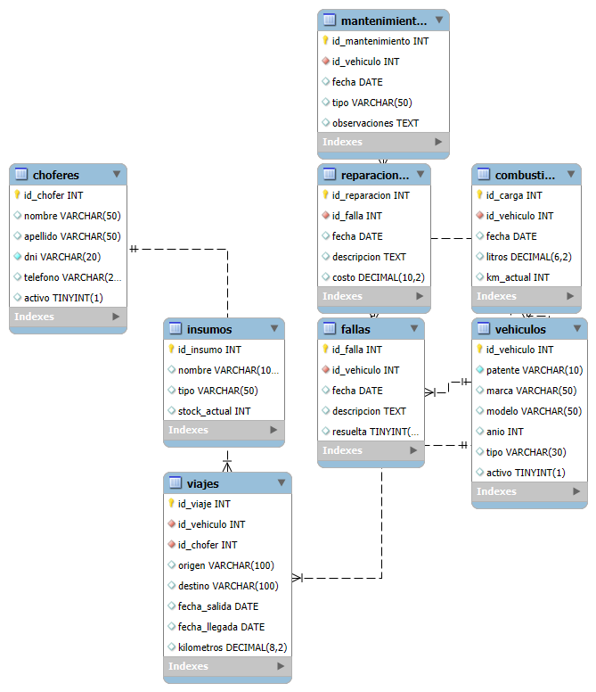

# Proyecto Final - Curso SQL

**Tema:** Gestión de Flota de Vehículos y Mantenimiento Preventivo  
**Autora:** Iona Schnaidler  
**Curso:** SQL 

## Descripción

Este proyecto tiene como objetivo diseñar una base de datos relacional para una empresa de transporte que necesita organizar la gestión de su flota, registrar viajes, controlar mantenimientos, fallas, reparaciones y consumo de combustible.

## Estructura del proyecto

El archivo principal es `GestionFlota_Schnaidler.sql`, que contiene:

- Creación de la base de datos `GestionFlota`
- Creación de todas las tablas necesarias
- Definición de claves primarias y foráneas

## Diagrama E-R

