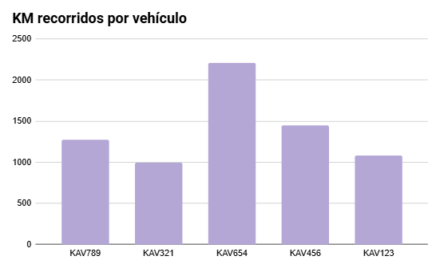
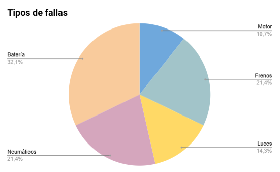
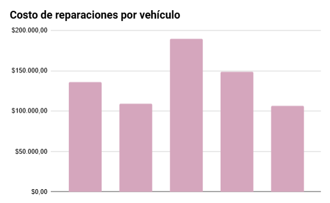

# Proyecto Final - Curso SQL

**Tema:** Gestión de Flota de Vehículos y Mantenimiento Preventivo  
**Autora:** Iona Schnaidler  
**Curso:** SQL 

---

## Introducción

Este proyecto tiene como finalidad el diseño e implementación de una base de datos para gestionar una flota de vehículos pertenecientes a una empresa de transporte. La solución propuesta permite centralizar y organizar la información relativa a los vehículos, los viajes realizados, los mantenimientos efectuados, las fallas mecánicas reportadas y las cargas de combustible, optimizando la operatividad del servicio y reduciendo costos operativos.

---

## Objetivo

El objetivo del proyecto es desarrollar una base de datos relacional que permita:

- Registrar vehículos con sus características y estado.
- Controlar los viajes realizados, incluyendo kilometraje, fechas y choferes.
- Llevar un historial de mantenimientos preventivos y correctivos.
- Registrar fallas y asociarlas con reparaciones realizadas.
- Gestionar el consumo de combustible y los insumos utilizados.

Esta base está pensada para integrarse con otras áreas de la empresa, como logística, mantenimiento y administración.

---

## Situación Problemática

Empresas de transporte sin un sistema centralizado enfrentan:

- Desorganización en la asignación de vehículos y choferes.
- Falta de seguimiento de mantenimientos y fallas.
- Alto costo por reparaciones no planificadas.
- Escasa trazabilidad sobre uso, kilometraje y consumo.

Una base de datos relacional permite ordenar la gestión de la flota y tomar decisiones basadas en datos.

---

## Modelo de Negocio

La base será utilizada por una empresa de transporte mediana que presta servicios logísticos y urbanos. Tiene distintos tipos de vehículos y personal operativo.

Actores principales:

- Área de Operaciones → carga de viajes y asignación de choferes.
- Taller Mecánico → registro de mantenimientos y fallas.
- Administración → seguimiento de consumo, costos y stock.

---

## Listado de Tablas

*Vehiculos*

| Campo       | Tipo          | Descripción                      |
|-------------|---------------|----------------------------------|
| id_vehiculo | INT PK        | Identificador del vehículo       |
| patente     | VARCHAR(10) UK| Matrícula del vehículo           |
| marca       | VARCHAR(50)   | Marca                            |
| modelo      | VARCHAR(50)   | Modelo                           |
| anio        | INT           | Año de fabricación               |
| tipo        | VARCHAR(30)   | Tipo (ómnibus, combi, etc.)      |
| activo      | BOOLEAN       | Si está en uso                   |

*Choferes*

| Campo      | Tipo           | Descripción                      |
|------------|----------------|----------------------------------|
| id_chofer  | INT PK         | Identificador del chofer         |
| nombre     | VARCHAR(50)    | Nombre                           |
| apellido   | VARCHAR(50)    | Apellido                         |
| dni        | VARCHAR(20) UK | Documento de identidad           |
| telefono   | VARCHAR(20)    | Teléfono de contacto             |
| activo     | BOOLEAN        | Si está disponible               |

*Viajes*

| Campo         | Tipo           | Descripción                            |
|---------------|----------------|----------------------------------------|
| id_viaje      | INT PK         | Identificador del viaje                |
| id_vehiculo   | INT FK         | Vehículo utilizado                     |
| id_chofer     | INT FK         | Chofer asignado                        |
| origen        | VARCHAR(100)   | Punto de salida                        |
| destino       | VARCHAR(100)   | Punto de llegada                       |
| fecha_salida  | DATE           | Fecha de salida                        |
| fecha_llegada | DATE           | Fecha de llegada                       |
| kilometros    | DECIMAL(8,2)   | Distancia recorrida                    |

*Mantenimientos*

| Campo            | Tipo           | Descripción                             |
|------------------|----------------|-----------------------------------------|
| id_mantenimiento | INT PK         | Identificador del mantenimiento         |
| id_vehiculo      | INT FK         | Vehículo intervenido                    |
| fecha            | DATE           | Fecha realizada                         |
| tipo             | VARCHAR(50)    | Tipo (cambio de aceite, revisión, etc.) |
| observaciones    | TEXT           | Detalles del servicio                   |

*Fallas*

| Campo        | Tipo           | Descripción                       |
|--------------|----------------|-----------------------------------|
| id_falla     | INT PK         | Identificador de la falla         |
| id_vehiculo  | INT FK         | Vehículo con problema             |
| fecha        | DATE           | Cuándo se detectó                 |
| descripcion  | TEXT           | Detalle del problema              |
| resuelta     | BOOLEAN        | Si fue resuelta                   |

*Reparaciones*

| Campo         | Tipo           | Descripción                             |
|---------------|----------------|-----------------------------------------|
| id_reparacion | INT PK         | Identificador de la reparación          |
| id_falla      | INT FK         | Falla relacionada                       |
| fecha         | DATE           | Fecha realizada                         |
| descripcion   | TEXT           | Qué se hizo                             |
| costo         | DECIMAL(10,2)  | Costo total                             |

*Insumos*

| Campo        | Tipo           | Descripción                            |
|--------------|----------------|----------------------------------------|
| id_insumo    | INT PK         | Identificador del insumo               |
| nombre       | VARCHAR(100)   | Nombre del producto o repuesto         |
| tipo         | VARCHAR(50)    | Tipo (lubricante, repuesto, etc.)      |
| stock_actual | INT            | Stock disponible                       |

*Combustible*

| Campo        | Tipo           | Descripción                           |
|--------------|----------------|---------------------------------------|
| id_carga     | INT PK         | Identificador de la carga             |
| id_vehiculo  | INT FK         | Vehículo cargado                      |
| fecha        | DATE           | Fecha de carga                        |
| litros       | DECIMAL(6,2)   | Cantidad cargada                      |
| km_actual    | INT            | Kilometraje al momento                |

---

## Diagrama E-R

---

### Vistas

- `vista_viajes_chofer`: Viajes con info del chofer y vehículo  
- `vista_mantenimientos_pendientes`: Fallas sin resolver y último mantenimiento  
- `vista_consumo_combustible`: Litros/100km por vehículo  
- `vista_reparaciones_costosas`: Reparaciones > $100.000  
- `vista_choferes_activos`: Choferes activos y total de viajes  

---

### Funciones

- `f_km_totales_vehiculo(id)`: Total de km por vehículo  
- `f_promedio_reparacion(id)`: Promedio de costos de reparación  
- `f_chofer_muy_activo(id, minimo)`: TRUE si supera un umbral de viajes  

---

### Stored Procedures

- `sp_registrar_viaje(...)`  
- `sp_resolver_falla(id_falla)`  
- `sp_mantenimiento_rutina(id_vehiculo, tipo, observaciones)`

---

### Triggers

- `tr_fecha_carga_combustible`: Agrega fecha actual si está vacía  
- `tr_falla_resuelta_actualiza_mantenimiento`: Registra mantenimiento cuando se resuelve una falla

---

## Datos de Prueba

Archivo: [`Datos_Gestionflota_Schnaidler.sql`](Datos_Gestionflota_Schnaidler.sql)  
Contiene entre 5 y 15 registros por tabla.  

---

## Script de creación

El script .sql con todas las tablas y claves está disponible en el archivo:  
[GestionFlota_Schnaidler.sql](GestionFlota_Schnaidler.sql)

---

## 📊 Dashboard Analítico

Análisis visual generado a partir de la base de datos:

